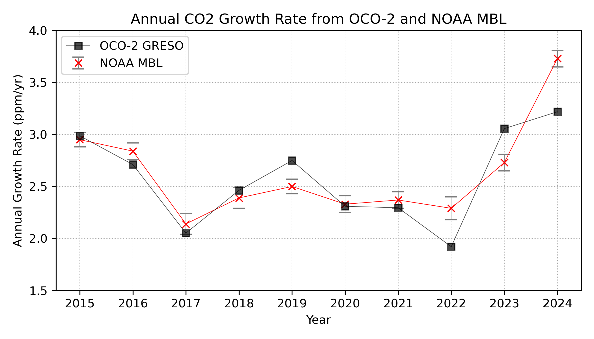

# GRESO: Growth Rate from Satellite Observations


*Figure: Growth rates from OCO-2 satellite observations compared to NOAA ground-based measurements*

## Overview

The GRESO code analyzes OCO-2 satellite data to compute global annual CO2 growth rates. 

**Publication**: Pandey, S., et al. (2024). [Toward low-latency estimation of atmospheric CO₂ growth rates using satellite observations](https://agupubs.onlinelibrary.wiley.com/doi/full/10.1029/2023AV001145). *AGU Advances*, 5, e2023AV001145.

## Quick Start

### Prerequisites
- Python 3.7+
- Packages: `numpy`, `pandas`, `xarray`, `matplotlib`, `scipy`, `python-dateutil`

### Installation
```bash
pip install numpy pandas xarray matplotlib scipy python-dateutil
```

### Running the Analysis
```bash
# Default analysis (MIPV11 format)
python greso_analysis.py

# Specific data type analysis
python greso_analysis.py --data-type LNLG
```

### Python API Usage
```python
from greso_analysis import AnalysisConfig, CO2GrowthRateAnalyzer

config = AnalysisConfig(
    data_file="/path/to/OCO2_b11.2_10sec_GOOD_r3.nc4",
    lat_range=[-50, 50],
    uncertainty_threshold=2.0
)

analyzer = CO2GrowthRateAnalyzer(config)
results = analyzer.process_oco_data(["all"])
```

## Data Sources

### OCO-2 Satellite Data
- **Format**: MIPV11 (NetCDF4, `.nc4` files) - recommended
  - Uses `xco2_2019_scale` variable with improved calibration
  - Download: [NOAA GML OCO-2 MIP](https://gml.noaa.gov/ccgg/OCO2_v11mip/download.php)
  - Direct link: [OCO2_b11.2_10sec_GOOD_r2.nc4](https://gml.noaa.gov/aftp/user/andy/OCO-2/OCO2_b11.2_10sec_GOOD_r2.nc4)
- **Legacy Format**: Standard HDF5 (`.h5` files)
  - Uses `xco2` variable

### NOAA Reference Data
- Automatically downloaded from: `ftp://aftp.cmdl.noaa.gov/products/trends/co2/co2_gr_gl.txt`

## Methodology

1. **Data Processing**:
   - Quality filtering (uncertainty threshold, data type)
   - Spatial filtering (latitude range: -50° to 50°)
   - Temporal processing and area-weighted averaging
   - Seasonal detrending using harmonic analysis

2. **Growth Rate Calculation**:
   - Annual differences in deseasonalized CO2
   - Direct comparison with NOAA global mean growth rates

## Results

Example output:
```
============================================================
ANNUAL GROWTH RATES - ALL DATA
============================================================
Year       | OCO-2 Growth Rate (ppm/yr) | NOAA Growth Rate (ppm/yr)
------------------------------------------------------------
2015       |               2.99 | 2.95
2016       |               2.71 | 2.84
2017       |               2.05 | 2.14
2018       |               2.46 | 2.39
2019       |               2.75 | 2.50
2020       |               2.31 | 2.33
2021       |               2.30 | 2.37
2022       |               1.92 | 2.29
2023       |               3.06 | 2.73
2024       |               3.22 | 3.73
------------------------------------------------------------
MEAN       |               2.50 | 2.50
============================================================
```


## Code Structure

```
greso_analysis.py    # Main analysis script
utils.py            # Utility functions and classes
```

### Key Components
- **AnalysisConfig**: Configuration management
- **OCODataProcessor**: Data loading and preprocessing
- **CO2GrowthRateAnalyzer**: Core analysis logic
- **VisualizationManager**: Plotting and visualization

## Citation

```
Pandey, S., Miller, J.B., Basu, S., Liu, J., Weir, B., Byrne, B., Chevallier, F., 
Bowman, K.W., Liu, Z., Deng, F. and O'dell, C.W., 2024. Toward low‐latency 
estimation of atmospheric CO2 growth rates using satellite observations: 
Evaluating sampling errors of satellite and in situ observing approaches. 
AGU Advances, 5, e2023AV001145. https://doi.org/10.1029/2023AV001145
```

## Contact

**Developer**: Sudhanshu Pandey  
**Affiliation**: NASA Jet Propulsion Laboratory / California Institute of Technology  
**Email**: sudhanshu.pandey[at]jpl.nasa.gov
